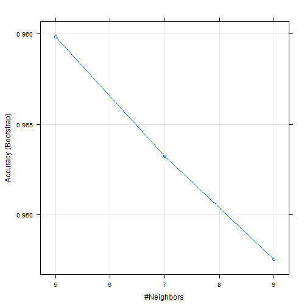

Human Activity Recognition Assigenment
========================================================

## Data Loading


```r
testData <- read.csv(file = "pml-testing.csv", header = TRUE, na.strings = c("", 
    "NA"))
trainData <- read.csv(file = "pml-training.csv", header = TRUE, na.strings = c("", 
    "NA"))
```


Now wen need to remove the first column which contain Ids


```r
testData <- testData[, -1]
trainData <- trainData[, -1]
```


The Data Set is 19622 by 159

Because of Using Instances based learning (i.e K Nearest Nighbor) KNN algorithm to predict, and the data set is large, it is better to remove columns and rows with huge number of missing values.
Any column contains missing values had been excluded, this is not the best thing to handle missing values because we could lost valuble variable with just one or two missing values. But it showed outstanding results.


```r
x = 0
for (i in 1:length(names(trainData))) {
    if (sum(is.na(trainData[, i])) > 0) 
        x <- c(x, i)
    
}
HAR <- trainData[, -x[2:length(x)]]
```


Now our Data Set is 19622 by 59 


## Sampling

Partitoning data into training and testing sets, 70% for Training and 30% for Testing

```r
library(caret)
```

```
## Loading required package: cluster
## Loading required package: foreach
## Loading required package: lattice
## Loading required package: plyr
## Loading required package: reshape2
```

```r
inTrain <- createDataPartition(HAR$classe, p = 0.7)[[1]]
training <- HAR[inTrain, ]
testing <- HAR[-inTrain, ]
```


We can compare the distribution of prediction class

```r
prop.table(table(training$classe)) * 100
```

```
## 
##     A     B     C     D     E 
## 28.43 19.35 17.44 16.39 18.38
```

```r
prop.table(table(testing$classe)) * 100
```

```
## 
##     A     B     C     D     E 
## 28.45 19.35 17.43 16.38 18.39
```


## Training

KNN had been used for with centering and scalling preprocessing


```r
library(caret)
set.seed(400)
knnFit <- train(classe ~ ., data = training, method = "knn", preProcess = c("center", 
    "scale"))
```

```
## Warning: executing %dopar% sequentially: no parallel backend registered
```


Output of kNN model

```r
knnFit
```

```
## 13737 samples
##    58 predictors
##     5 classes: 'A', 'B', 'C', 'D', 'E' 
## 
## Pre-processing: centered, scaled 
## Resampling: Bootstrap (25 reps) 
## 
## Summary of sample sizes: 13737, 13737, 13737, 13737, 13737, 13737, ... 
## 
## Resampling results across tuning parameters:
## 
##   k  Accuracy  Kappa  Accuracy SD  Kappa SD
##   5  1         0.9    0.003        0.004   
##   7  1         0.9    0.003        0.004   
##   9  0.9       0.9    0.004        0.005   
## 
## Accuracy was used to select the optimal model using  the largest value.
## The final value used for the model was k = 5.
```


Plotting yields Number of Neighbours Vs accuracy

```r
plot(knnFit)
```

 


## Test Prediction 

Here we predict on the testing set, and show the confusion matrix 


```r
knnPredict <- predict(knnFit, newdata = testing)
confusionMatrix(knnPredict, testing$classe)
```

```
## Loading required package: class
```

```
## Confusion Matrix and Statistics
## 
##           Reference
## Prediction    A    B    C    D    E
##          A 1662   21    0    0    0
##          B    5 1099   10    0    0
##          C    6   19 1010   25    1
##          D    0    0    6  933   10
##          E    1    0    0    6 1071
## 
## Overall Statistics
##                                         
##                Accuracy : 0.981         
##                  95% CI : (0.978, 0.985)
##     No Information Rate : 0.284         
##     P-Value [Acc > NIR] : <2e-16        
##                                         
##                   Kappa : 0.976         
##  Mcnemar's Test P-Value : NA            
## 
## Statistics by Class:
## 
##                      Class: A Class: B Class: C Class: D Class: E
## Sensitivity             0.993    0.965    0.984    0.968    0.990
## Specificity             0.995    0.997    0.990    0.997    0.999
## Pos Pred Value          0.988    0.987    0.952    0.983    0.994
## Neg Pred Value          0.997    0.992    0.997    0.994    0.998
## Prevalence              0.284    0.194    0.174    0.164    0.184
## Detection Rate          0.282    0.187    0.172    0.159    0.182
## Detection Prevalence    0.286    0.189    0.180    0.161    0.183
```


The Out of sample error rate is 0.0187


## Submision Predictions

Now We can apply the model to predict the unknown values, and seave them into text files.

```r
FinalPredict <- predict(knnFit, newdata = testData)

write_files = function(x) {
    n = length(x)
    for (i in 1:n) {
        filename = paste0("problem_", i, ".txt")
        write.table(x[i], file = filename, quote = FALSE, row.names = FALSE, 
            col.names = FALSE)
    }
}
write_files(FinalPredict)
FinalPredict
```

```
##  [1] B A B A A E D B A A B C B A E E A B B B
## Levels: A B C D E
```


